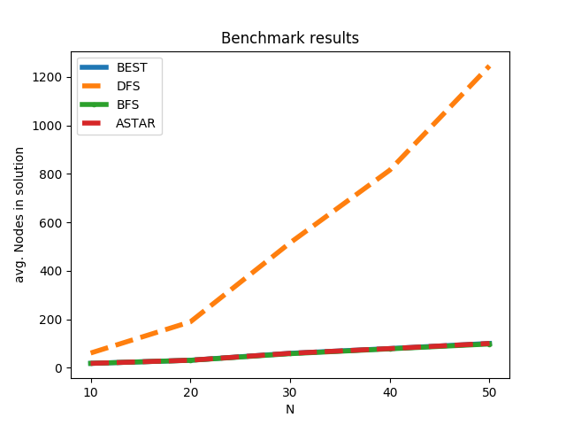
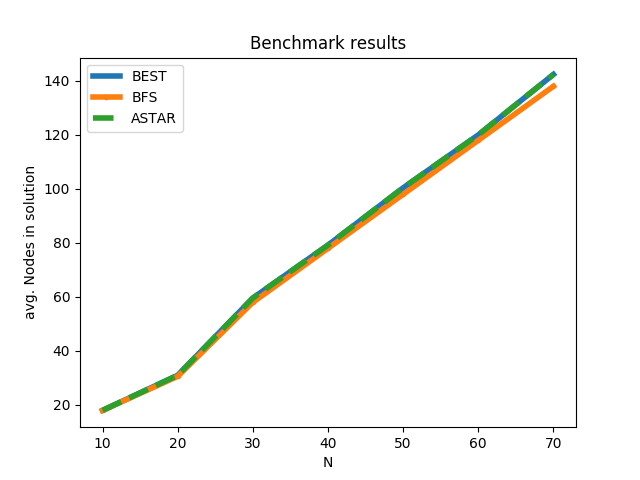

# search-server
This [project](https://github.com/idoze2/search-server/) was written as part of the Advanced Programming 1 Course (89210), BIU.

## Dependencies
- g++
- GNU-Make
- Python 3
```bash
sudo apt install g++ make Python3
```

## Usage:
Note: must be used on a unix machine.

<b>Compile an out-of-source BFS server binary file from src, and run it:</b>
```bash
make build/main
./build/main <PORT (optional)>
```

<b>Clean the repository from all binary files, header files, and runtime-generated data:</b>
```bash
make clean
```

<b>Clean the cache folder:</b>
```bash
make clean_cache
```

### Additional Makefile Commands
<b>Compile and run with specific Algorithm, or with debug output:
Note, this creates a.out as to simulate a regular g++ command invocation.</b>
```bash
make <compile,run> <ALGO=[BFS,ASTAR,BEST,DFS]> <DEBUG=1>
```

### Benchmark
The results shows that BFS is the most node-efficient, as seen here:

and zoomed:

(The data used to generate this image is located in benchmark/data)

To generate such an image, use the following command:
It compiles and runs instances of each algorithm, a server and a client, generates 50 matrices from 10x10 to 50x50
conducts an empirical experiment on the generated data, and sums up the results into benchmark/results.png
```bash
make benchmark
```

You could also use any of the following to specify a single algorithm for the experiment:
```bash
make [BEST, BFS, DFS, ASTAR]
```
BIU © [Ido Zeira](http://github.com/idoze2), [Allen Bronshtein](http://github.com/allenbronshtein)
